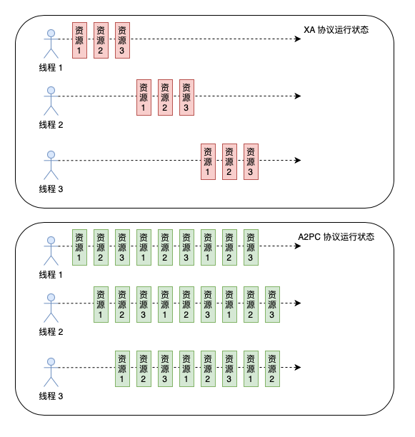

# A2PC

A2PC （Asynchronous Two-Phase Commit）是一个安全、高性能、开源的分布式事务解决方案。原理上是基于[ 2PC 算法](https://zh.wikipedia.org/wiki/二阶段提交) 与[ MVCC ](https://zh.wikipedia.org/wiki/多版本并发控制) 结合的演变。在事务的管理上借鉴了 2PC 算法，整体分为两个阶段，来确保事务操作的完整。结合 MVCC 机制实现不同事务之间的隔离。

至于为什么要一定要使用事务。
> We believe it is better to have application programmers deal with performance problems due to overuse of transactions as bottlenecks arise, rather than always coding around the lack of transactions.   
在因为使用事务而引起问题的时候，优化使用事务的方式优于放弃使用事务。  
[Spanner: Google’s Globally-Distributed Database](https://static.googleusercontent.com/media/research.google.com/en//archive/spanner-osdi2012.pdf)

## 事务保障
1. 第一阶段，解析 SQL 语句，计算出写入前（undo log）和写入后（redo log）的镜像，和数据修改一起提交到本地事务中，因为在同一个本地事务中，可以保证事务操作的完整。
2. 第二阶段：
    - **提交**，因为在第一阶段的时候已经提交过本地资源。TM 只需要修改全局事务状态即可提价事务，释放全局锁。
    - **回滚**，在第一阶段的时候已经写入了 undo log，根据 undo log TM 会讲 RM 中的数据进行回滚，如果当中有超时，TM 会一直重试直到成功后释放全局锁。

下面结合例子，说明一下 A2PC 的处理流程。

### 事务提交
当前有 2 个数据库表 product 商品表、order 订单表， product 在数据节点 A 上， order 表在数据节点 B 上。 表结构定义大致：
```sql
CREATE TABLE `product` (
  `id` bigint(20) NOT NULL AUTO_INCREMENT,
  `product_name` bigint(20) NOT NULL,
  `stock` bigint(20) NOT NULL,
  PRIMARY KEY (`id`)
) ENGINE=InnoDB DEFAULT CHARSET=utf8;

CREATE TABLE `order` (
  `id` bigint(20) NOT NULL AUTO_INCREMENT,
  `product_id` bigint(20) NOT NULL,
  `user_id` bigint(20) NOT NULL,
  `quantity` int(11) NOT NULL,
  `status` int(4) NOT NULL DEFAULT '0',
  PRIMARY KEY (`id`),
  UNIQUE KEY `un_up` (`user_id`,`product_id`)
) ENGINE=InnoDB DEFAULT CHARSET=utf8;
```
PiDAL 在启动的时候会解析表结构并记录下来。

当用户 1 下单 商品 id 2 的时候的时候。order 表初始数据为空。product 表数据为：

| id | product_name | stock |
|--- | ------------ | ----- |
| 2  | 测试商品      |   10  |

#### 第一阶段
1. 启动一个事务。`begin`。这个时候 PiDAL 会创建一个 A2PC 事务对象。
2. 创建一个订单，`insert into order (product_id, user_id, quantity, status) VALUES (2, 1, 3, 0)`;这个时候 PiDAL 会解析这个 SQL（[PiDAL 是不是受限于解析 SQL 的能力？](/faq?id=pidal-是不是受限于解析-sql-的能力？)），获取到是插入表 `order` ，根据启动的时候解析表结构得到：
    - undo log 是 空
    - redo log 是 
    ``` json
    {
        "product_id": 2,
        "user_id": 1,
        "quantity": 2,
        "status": 0
    }
    ```
    - 数据全局锁需要锁定的数据唯一标识是 `product_id = 2 and user_id = 1`。
    - 然后会把 redo undo log 一起发给当前数据节点，保证和创建订单在同一个本地事务中。
    但是此时本地事务是不会提交的。

3. 本地事务提交之前，PiDAL 会向 TM 申请全局锁，全局锁的标识是 `product_id = 2 and user_id = 1`。
4. 拿到全局锁之后，PiDAL 才会在 order 表的数据节点提交本地事务。
5. 要减少 product 的库存，此时 APP 先获取商品 id 2 的本地锁（减少对热点数据的锁定时间）。`select * from product where id = 2 for update`，这时候 PiDAL 会解析这个 SQL，根据表结构得到全局锁唯一标识是 `id =2`。因为是数据上锁，所以拿到的数据一定最新的数据，根据表定义 PiDAL 会把返回值记录在 A2PC 事务对象中，方便生成 undo log 。
6. 减少库存，执行 `update product set stock = 7 where id = 2`，PiDAL 依然会解析这个 SQL，得到 redo log。此时：
    - undo log 是：
    ```json
    {
        "id": 2,
        "product_name": "测试商品",
        "stock": 10
    }
    ```
    - redo log 是：
    ```json
    {
        "id": 2,
        "product_name": "测试商品",
        "stock": 7
    }
    ```
    - 全局锁唯一标识是 `id = 2` 。
    - 然后把 redo undo log 一起发给当前数据节点，保证和减少库存在同一个本地事务中。此时依然不提交本地事务。
7. 在本地事务提交之前，PiDAL 会去获取 `id = 2` 全局锁，拿到全局锁之后向 product 的数据节点提交本地事务。
截止至此本地事务全部成功，第一阶段到此结束。

#### 第二阶段
1. 提交全局事务 `commit`。因为本地是为已经提交过了。所以这一步 TM 只需要把这个全局事务状态置为 `COMMITED` 即可。

### 事务回滚
第一阶段所有的步骤和提交的时候一样，在第二阶段回滚事务的时候，全局锁依然在这个全局事务中，TM 收到 `rollback` 的时候，会获取这个全局事务下的所有本地事务。根据 undo log 。会把数据还原到事务启动之前的样子。即便这之中有失败，TM 会不断重试，保证数据最终被还原。当确认所有分支事务都回滚之后，TM 会释放 product 表 `id =2` 和 order 表 `product_id = 2 and user_id = 1` 的全局锁。

### 并发写
A2PC 有全局锁，在并发写的是也不会发生数据的赃写。
还以上面的场景为例子，用户 1 和用户 2 同时下单，分别下单 3 个商品。初始场景下 商品库存数为 10 。
1. 因为 order 表中用户 1 和用户 2 的全局锁并不冲突，这两个订单可以并发的创建。  
2. 到了减少库存这一步骤，假设用户 1 和用户 2 直接执行 `update product set stock = stock - 3 where id = 2`，不执行` for update `获取本地锁。因为用户 1 和用户 2 是在同一个数据节点竞争同一个数据的本地锁，因为这里是本地锁，最终只会有一个人拿到本地锁，假设用户 1 拿到本地锁，用户 1 执行 `update product set stock = stock - 3 where id = 2`, PiDAL 正常执行 undo log、redo log 逻辑。此时用户 2 还在等待获取本地锁。
3. 用户 1 在本地事务提交之前，会向 TM 申请 product 表中 `id = 2` 的全局锁，拿到后提交本地事务，释放本地锁。此时用户 2 拿到 `id = 2` 的本地锁。
4. 用户 2 在拿到本地锁之后，执行 `update product set stock = stock - 3 where id = 2` 此时 PiDAL 解析 SQL 并生成 undo log、redo log：
    - 因为没有执行 ` for update ` PiDAL 的事务对象没有 undo 数据，PiDAL 会自己执行 `select * from product where id = 2 for update` 确保拿到最新数据。此时的 undo log 是：
    ```json
    {
        "id": 2,
        "product_name": "测试商品",
        "stock": 7
    }
    ```
    - redo log 是：
    ```json
    {
        "id": 2,
        "product_name": "测试商品",
        "stock": 4
    }
    - 用户 2 生成 redo undo log 插入数据库，此时本地事务并未提交。

因为此时用户1 和用户 2 的全局事务还是活跃状态，是否最终提交还不确定，如果此时用户 1 回滚了全局事务，那么用户 2 基于 `stock = 7` 来进行操作就不符合预期。所以我们这里分三种情况进行讨论。

#### 用户 1 正常提交
用户 1 正常提交之后，用户 2 拿到本地数据就是正确的，可以继续正常的执行操作。这样用户 2 的提交和回滚和用 1 无关了。

#### 用户 1 回滚
如果用户 1 决定回滚事务，此时 product 表中 `id = 2` 全局锁依然在用户 1 这里，用户 2 的本地事务会因为拿不到全局锁而不会进行提交。

1. 用户 1 在回滚的时候，无法获取到 product 表中 `id = 2` 的本地锁，开始等待本地锁释放。
2. 用户 2 在提交本地事务之前无法拿到 `id = 2` 的全局锁，开始等待全局锁释放，直到全局锁等待超时。回滚本地事务。
3. 此时 `id = 2` 的锁一直在用户 2 手里，只需要回滚本地事务即可。回滚本地事务后，TM 会开始回滚 order 表的本地事务。
4. 因为用户 2 已经释放了 product 表中 `id = 2` 的本地锁，用户 1 拿到本地锁，用户 1 的操作开始回滚。
5. 此时用户 1 和用户 2 的事务都已经回滚，数据安全，没有发生脏写。


## 事务隔离
A2PC 除了确保事务操作同时成功和失败之外。事务之间的隔离依然重要。在 A2PC 的实现中可以根据需求实现: [读已提交](https://zh.wikipedia.org/wiki/事務隔離)、[读已提交](https://zh.wikipedia.org/wiki/事務隔離) 两种隔离。  

### 读未提交
因为 A2PC 的每个分支事务，都是已经提交了的。读未提交的实现不需要额外处理，直接到数据节点查询即可。

### 读已提交
同样也是因为 A2PC 的每个分支事务，都是已经提交了的。但是 A2PC 的 undo log、redo log 机制下依然可以实现读未提交，通过 `reundo_log` 可以直到要查询的数据最后一个事务的 undo log、redo log 以及事务是否提交的等信息，从而实现读已提交。

在 PiDAL 的实现里，出于对性能的考虑，只对 `select for update` 的实现了「读已提交」，对没有普通的读取只有读为提交。

## 与 XA 协议对比
A2PC 在运行时，不仅减少了 RPC 次数，还大大减少了资源被锁定的周期，单位时间内可以处理更多的业务逻辑而不会被阻塞。在运行，XA 和 A2PC 的对比：  




## 如何使用 A2PC？
A2PC 可以在任何数据库中间件、数据库驱动、甚至 ORM 中都可以落地，PiDAL 已经实现了 A2PC ，可以直接使用，或者自己按照 A2PC 规范自己实现。
后续 Pi 计划也会将 A2PC 整合到一些流行的 ORM 库中，方便更多的项目可以低成本的使用到 A2PC。

| 项目 | 实现角色 | 地址 | 进度 | 说明 |
| --- |  --- | --- | --- | --- |
| PiDAL | APP，TM | https://github.com/pi-plan/pidal | 开发中 | |
| GORM | APP | https://github.com/pi-plan/gorm | 设计中 | Golang 中流行的 ORM 库整合 A2PC |
| A2PC-MySQL | TM | https://github.com/pi-plan/a2pc-mysql | 开发中 | 直接在 MySQL 上实现 TM 角色 |
| A2PC-GRPC | APP | https://github.com/pi-plan/grpc-go | 规划中 | 支持跨服务的分布式事务 |