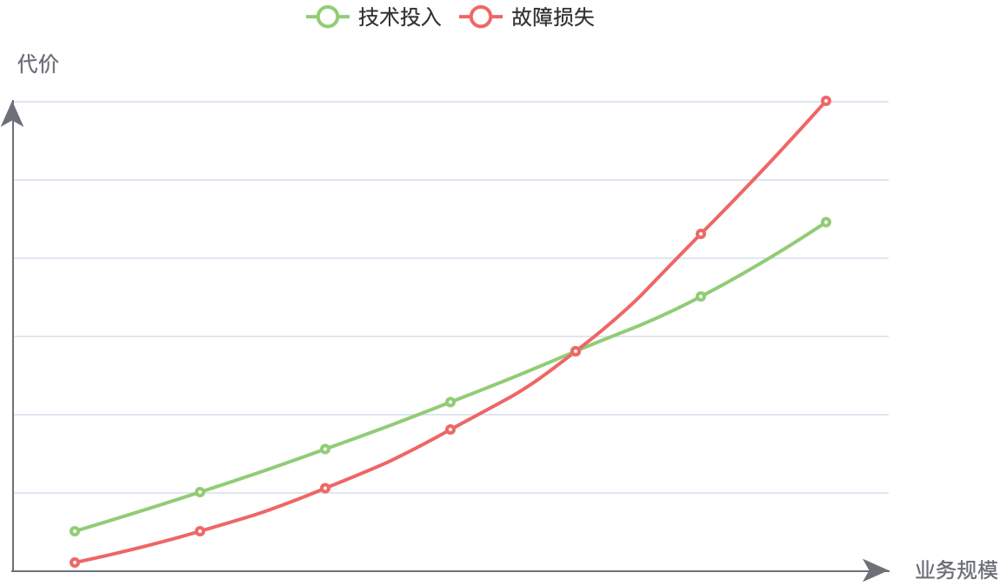
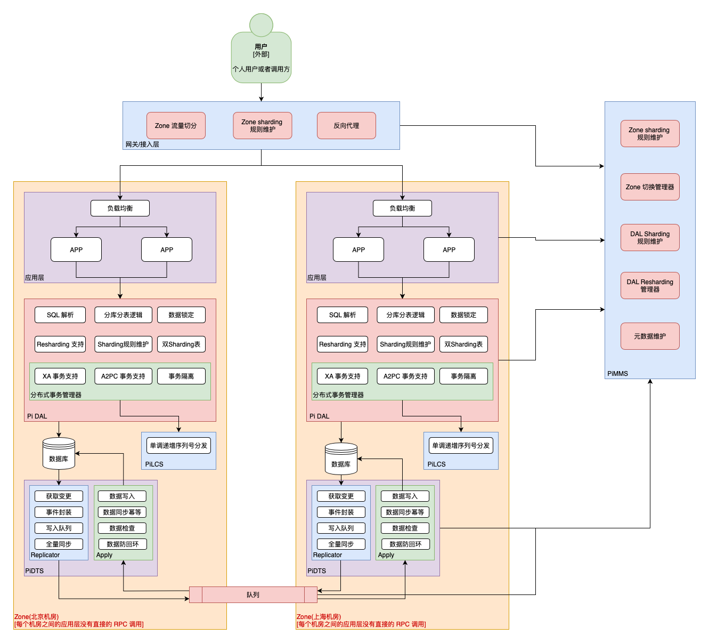

# 异地多活架构

## 什么是异地多活
异地多活架构其实就是一种高可用的分布式架构。先从名字来说，「异地」是指在跨的地区、省市、甚至国家的建立数据中心。其中的「多」是只两个及以上的数据中心，在 Pi 计划中的异地多活架构中能够支撑数十个甚至上百的数据中心同时对外提供服务。其中的「活」是只，异地的每个数据中心都是同时对外提供服务的，相对的「冷备份」只有在启用的时候才会提供服务，平时状态下，是不会对外提供服务的。而且「活」也意味着灵活，其中任何一个数据中心故障失效了，能够迅速的将故障中心的用户和业务逻辑转移到其他中心，继续正常的提供服务。

<!--
说到分布式架构就不可避免的提到 [CAP 定理](https://zh.wikipedia.org/wiki/CAP定理)，用 CAP 的方式描述 Pi 计划的异地多活方案就是：牺牲一定 C 来换取 AP。在 Pi 计划的方案中，也对 C （**C**onsistency 一致性）有一定的优化，牺牲的 C 也不会一想到业务。
-->

## 为什么需要异地多活？
随着互联网行业的多年发展，互联网已经深入到各行各业，生活的方方面面。用户对互联网服务的依赖越来越重，对服务稳定性也越来越敏感。对服务的可用性要求从 99.9% 到 99.99% 甚至 99.999% 不断提高。高可用架构也主键称为企业为用户提供 7 * 24 不间断服务的主要手段。单个数据中心的高可用架构，虽然能一定成都的能提高业务的可用性，但是在面临一些数据中心整体性故障的时候，依然无法继续提供服务。即便抛开供应商、自然灾害这些外界因素，人为的配置出错，造成整个数据中心不能正常运行，网络供应商 DSN 、路由问题造成部分用户不能访问到数据中心这些也是频发的问题。在面临这些问题且又没有异地多活架构的时候，只能等待，束手无策，直接可以让 99.999% 的可用性直接破灭。

除了对可用性的要求，单机个数据中心也有承载的上限，业务不大发展，达到数据中心承载上限之后，为了不影响业务的发展，不得不进行扩展。多活架构可以同时使用多个数据中心，不会受到单个机房的承载上限影响，能够长久的支撑业务发展。

### 对比同城双中心
在通常与异地多活对比的方案是同城双活，同城双活是指在一个区域同时有两个数据中心，因为不垮地区，两个数据中心之间延迟很低，对业务方来说几乎可以不用区分是两个机房在提供服务。但是同城双活毕竟是在同一个地区在遇到 DNS 问题、电力问题，自然灾害的时候依然会造成整体不可用。而且两个数据中心虽然延迟很低，只是相比异地之间很低，与同数据中心延迟相比，还是有比较高的通讯成本。而且即便实现了同城双活，高可用的保障能力也只是限制于两个数据中心，而多活架构中数据中心数量不受限制，双活架构和多活架构之间并不相同。

### 为什么要多活不是热备？
相比异地多活，不少企业已经实现并落地了异地热备，就是主数据中心负责写入，异地或者同城其他数据中心实时同步，在主数据中心遇到问题的时候，从中心迅速替代。然而这种架构真的有效吗？最近几年不少大企业在主数据中心遇到问题的时候，从数据中心并不能替代主数据中心，只能等待主数据中心恢复后才能继续提供服务。这其中原因有多点，其中最重要的**「是异地数据中心并未经过验证，在主数据中心遇到问题后，没有人敢进行切换，也没有人直到进行切换之后，异地数据中心是否能正常提供服务，甚至都无法确定会不会造成数据损坏，引起更大的问题。」**

### 投入成本和产出比
还有很多企业不落地异地多活架构是因为投入和产出比不高，自己做异地多活架构投入成本高，相比较而言带来的收益却抵消不了成本。请看下图：  

对于一个在增长中的业务来说，不管是经济损失还是形象、口碑的损失，每次故障带来的损失也相应是加速增长的。而技术的投入总体上是线性的，初期故障损失小于技术投入，在某个时间点，故障的损失会超过技术投入，这时就要用一些更高可用方案，来避免故障。异地多活是高可用方案中最重要的技术手段。  

## Pi 计划
Pi 计划通过抽象、组件设计，设计出一套能让各种业务落地异地多活架构的方案，不限制业务类型。通过 Pi 计划，可以大大的降低实现异地多活架构的成本，在业务发展初期即可用低成本实现异地多活，保障业务的稳定。

### Pi 计划多活架构

上图是 Pi 计划中关于异地多活的架构图，实例中虽然只有两个 [Zone](/terminology?id=zone)，但是 Pi 计划是支持更多个 Zone 之间组成的高可用架构。

#### 用户
作为业务的使用方，可以是个人用户，可以是内部的其他业务线，也可以是 to B 的商务客户。是业务逻辑的起点。

#### 网关/接入层
这一层是业务面向用户的第一层，也是异地多活架构的起点。这一层主要职责是根据 [Zone Sharding](/terminology?id=zone-sharding) 规则对流量进行分发，这一层可以从 [PiMMS](/introduction?id=pimms) 实时查询或者推送到最新的 Zone Sharding 规则。 Pi 计划暂无规划会提供这一层相关的组件，因为没有必要，每个业务自身应该已经有落地自己的接入层实现，在做异地多活改造的时候，并不需太高的成本，仅仅只需要增加 Zone Sharding 逻辑即可。

##### 多活拆分
具体如何进行 Zone Sharding，Pi 计划并不会强制限制，每个业务可以根据自己的场景进行合理的划分，以方便实现业务的「单元化」。每个业务有自己的场景，也有适合自己的拆分规则。以外卖类系统为例，并不能按照用户来划分，因为一笔外卖订单，外卖系统本身就是一个实时性和可用性要求很高的系统，从用户下单、商户接单、分配骑手都需要尽最大努力的快，这期间会涉及到用户、商家、骑手三方有可能三方会落在不同的 Zone 上，这样做可能会出现夸机房的调用和服务延迟，难以保障实时性。相反如果是一个电商系统，就适合使用以用户来进行切分的规则。

确定拆分规则之后，比如以「用户」为纬度进行拆分，不同的用户 ID 可能会分配到不同的 Zone 上，那么 用户 ID 就是 [Zone Sharding Key](/terminology?id=zskey-zone-sharding-key)，根据规则计算出唯一的一个 [Zone Sharding ID](/terminology?id=zsid-zone-sharding-id) ，每个 Zone Sharding ID 只会被分配到一个 Zone。这样接入层就能对流量进行分配，把用户的请求分配到对应的 Zone 中去处理。

#### 应用层
这一层是业务逻辑，每个业务都是自己实现，不管是什么样子的架构，都不会影响到异地多活架构的实施，不过需要注意的是这一层尽量避免发生跨 Zone 的调用，因为跨 Zone 之间有着比较高的网络延迟，会降低业务的响应时间。当然这也并不是落地异地多活的必要条件，业务中如果有需要也一样是可以存在的，并不会对多活架构造成影响。

#### PiDAL/数据访问层
这一层在异地多活架构中数据的保护屏障（[异地多活中的数据安全保障](/multi-site-high-availability/data-security)），PiDAL 就是作用在这一层，PiDAL 除了提供业务中常用的分库、分表、读写分离、分布式任务等功能，还为异地多活提供了数据安全保障，能屏蔽掉错误的 Zone 的写入请求。在多 Zone 之间互相同步数据的时候，也能为同步逻辑提供支持。这一层的作用在[异地多活中的数据安全保障](/multi-site-high-availability/data-security)中有详尽的描述。

#### 持久化层
这一层会持久化存储所有的数据，其他 Zone 中的数据通过 PiDTS 同步过来其他 Zone 中的所有的数据。每个用户的读写操作还是在归属的 Zone 中进行。这里存储所有的 Zone 数据是为了在多活切换的时候 Zone 中具备该 Sharding ID 的所有数据，可以安全的进行切换。

PiDTS 除了支持常规的数据同步和流控，在异地多活架构中还有独有的问题需要解决。比如：多主模式下的数据回环问题。PiDTS 在 PiDAL 的协作下，以低成本、低性能损耗、低入侵的方式解决了这类问题（[数据防止回环](/multi-site-high-availability/data-security?id=数据防止回环)）。

#### PiMMS
是一个高可用的元数据管理中心，负责同步和管理各种元数据和协调各个组件之间的规则。在异地多活中，Zone Sharding 中的各种元数据都由 PiMMS 保存，PiMMS 是跨 Zone 部署的，多个 Zone 之间只会又一个主节点负责写入。当主节点故障之后，从节点会迅速的竞选上岗，保证系统的可用性。

## 反馈于问答

关于落地 Pi 计划异地多活方案，您有意见、建议、反馈、问答等等可以在 [GitHub](https://github.com/pi-plan/plan) 上创建 Issue。我们会及时跟进反馈。热烈欢迎您的反馈。