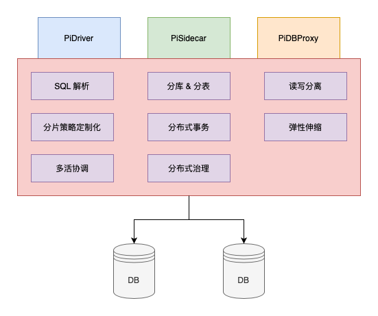

# PiDAL

PiDAL(Pi Data Access Layer) 是一个纯异步、高性能、兼用 MySQL 通讯协议的数据库中间件。不仅提供了常规的分库、分表、读写分离等功能，还基于 [A2PC 协议](/a2pc/introduction) 实现了分布式事务处理能力，无入侵、对客户端完全透明，无需额外兼容即可保证分库分表后数据的正确性。

- [Github](https://github.com/pi-plan/pidal)

PiDAL 不仅支持以 DB Proxy 模式部署，在容器化实施的比较完善的场景下，PiDAL 也能以 Sidecar 的模式部署，可以降低不必要的性能消耗。DB Proxy 和 Sidecar 模式之间的区别和优缺点对比详情可以 [点击这里查看](/pidal/introduction?id=driver、sidecar、dbproxy)。

另外，PiDAL 还对分布式数据库中常见的问题，PiDAL 提供了 [双 Sharding 表](/pidal/sharding-paging) 解决方案，在开发过程中减少因为分库对开发过程的影响。在 PiDTS 组件的协同下，不仅支持数据库在线扩容也支持数据库 Sharding 规则的重新调整。
PiDAL 也支持在先热更新，不需要重启，即可平滑的升级配置规则，在配置更新过程中，会平滑的维护好每个会话和事务，保证平滑结束，对客户端完全透明。

## 基本概念
在使用 PiDAL 之前，需要先了解一些基本概念，这样能更好的使用 PiDAL。

### 分库分表
为什么要分库分表？传统的将数据集中存储在单一的数据节点，这种方式已经无法满足互联网行业海量数据和高并发的场景需求了，从存储容量来说，单一节点始终存在容量上限，触发容量上限，也只是时间问题。在并发性能上，业务节点大都是无态的，单一节点在处理互联网这种海量并发的场景下已经称为系统的最大瓶颈。要想解决这些问题，只能数据分片（DB Sharding）的方式解决。

数据分片（DB Sharding）是指按照一定的规则，把数据分散到不同的数据库或者表中，从而解决单一数据节点的问题。通过拆分，保持每个分片的数据量在一个阈值范围内，对高并发的流量分发到不同的分片，从而解决高并发的性能问题。PiDAL 提供分库分表的策略，对客户端来说，这个分库分表的逻辑是完全透明的，无论真实分了多少库表，使用的时候对于客户端来说都是一张逻辑表，PiDAL 自己处理分库分表的逻辑。[分库分表](/pidal/sharding) 介绍了如何在 PiDAL 中使用分库分表逻辑。

数据分片虽然解决了单一数据节点的问题，但是同时也来了新的问题。单一数据节点的时候，数据的变更都是在同一个数据节点发生，可以很好的通过一个本地事务结局。在数据拆分之后，同一个事务中的数据可能出现在不同的分片上，这种跨 Sharding 的事务就是分布式事务。

### 分布式事务
分布式事务一直是个棘手的问题，虽然流行的数据库，比如：MySQL，PostgreSQL 都是支持 [XA 协议](https://zh.wikipedia.org/wiki/X/Open_XA)，但是因为这个协议的锁周期长、并发低、性能低等原因并没有被广泛的使用。PiDAL 采用了 [A2PC 协议](/a2pc/introduction) 的分布式事务解决方案，相比 XA 协议，A2PC 锁周期更短，网络 RPC 次数少，并发高，性能高。[分布式事务](/pidal/transaction)这里介绍了如何在 PiDAL 中使用 PiDAL 的事务模型。

### 双 Sharding 表
关注、收藏、点赞等类似的需求在互联网场景下是十分常见的需求，这些需求的通过抽象后都有一个特征：两个对象之间的关联关系，且需要从任意一个对象得到另一类对象的列表。比如用户 1 点赞了视频 1，即需要查询用户1 点赞的所有视频，也需要查询到所有点赞了视频 1 的用户。在单一数据节点下，可以很好的得到这两个纬度的数据。但是在分库分表的场景下，就变得棘手了。如果以用户的纬度进行拆分，那么在获取该视频所有点赞用户就需要查询所有分片了，而且还有[跨 Sharding 分页的难题](/pidal/sharding-paging)。针对这种常见的问题，PiDAL 设计了[双 Sharding 表](/pidal/sharding?id=配置)，双 Sharding 表会保存两份数据，分别是以用户、视频 两个纬度做拆分，在查询的时候，PiDAL 会根据 SQL 条件进行调度选择合适数据分片进行查询。在数据写入的时候，得益于 A2PC 协议，两份数据不会出现不一致的问题。业务在面对类似场景的需求时，能大大的降低开发难度和开发周期。

## DB Driver、Sidecar、DBProxy
PiDAL 支持 Sidecar、DBProxy 两种部署方式，为了能了解这之间的差异，我们了解下应用程序访问数据库的几种模式。  
一般情况下应用和数据进行交互的实现有三种模式。如下图

第一种是以 Driver 的方式潜入到应用层的代码中，这种方案入侵性最大，而且需要针对每个语言单独定制对应的 Driver。但是这种方式把控制权尽量的一觉个业务方，业务方可以根据自己的场景做出优化，比如在事务中并发等等。

第二种适合容器化做的比较好的项目，以 Sidecar 的方式运行，脱离语言的限制，而且是去中心化的，不会一个出问题，所有的都出问题。类似 Database mesh 的概念。

第三种是目前使用比较多的，也是介绍里面饿了么用的方案。就是针对DB 做 DB Proxy ，这种方案的有点比较明显，因为是中心化的，在管控的时候相对容易。

三种方式对比

| | Driver | Sidecar | DBProxy |
| :--- | :--- | :--- | :--- |
| 数据库支持类型 | 任意数据库 | 任意数据库 | 单一数据库 |
| 连接数消耗 | 高 | 高（同 Driver） | 低 |
| 编程语言支持 | 单一语言 | 任意语言 | 任意语言 |
| 性能损耗 | 损耗低 | 损耗低 | 损耗高 |
| 中心化 | 去中心化 | 去中心化 | 中心化 |
| 静态入口 | 无 | 无 | 有 |

三种方案，各有优缺点，不过抽象之后，会发现，三种方案，只是在和应用层的交互方式上有区别。比如 SQL 解析、数据分片、分布式事务、数据库治理等功能都是可以复用的。所以可以核心逻辑实现一种，在交互上封装出不同的方式，就能实现三种。

